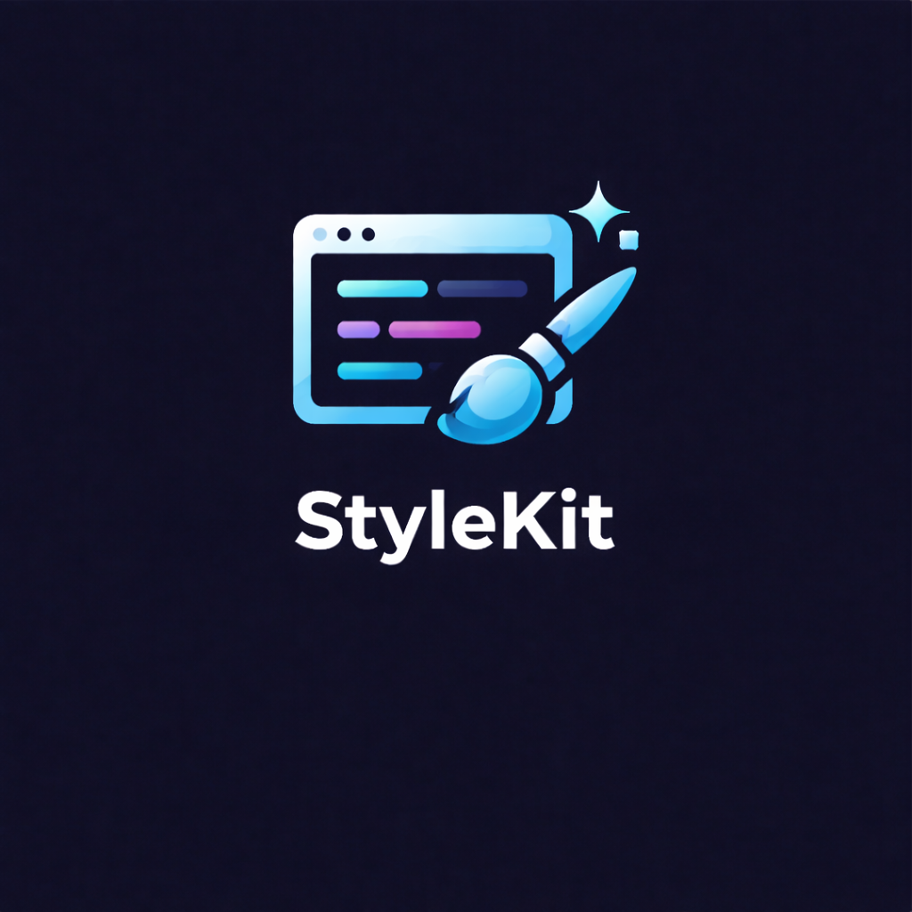

<!-- codex-branding:start -->
<p align="center"></p>

<p align="center">
  
  
  
</p>
<!-- codex-branding:end -->

# StyleKit


**StyleKit** is a browser extension that lets you customize any website's appearance instantly. Pick elements visually, tweak colors and fonts, or write raw CSS -- your changes are saved automatically and persist across visits.

Built on [Stylebot](https://github.com/ankit/stylebot) by Ankit Ahuja, StyleKit is a complete modernization with a Catppuccin Mocha dark theme, plain-English labels, guided onboarding, security hardening, and full Manifest V3 compliance.

## Features

### Visual CSS Editor
- **Point-and-click styling** -- select any element on the page, then adjust fonts, colors, spacing, borders, and visibility through an intuitive panel
- **Multi-select elements** -- hold Shift and click to add elements to the selector (e.g., `h1, h2, h3`)
- **Element search** -- find elements by CSS selector, tag name, class, ID, or text content
- **Plain English labels** -- "Text Size" instead of `font-size`, "Fill Color" instead of `background-color`
- **1,500+ Google Fonts** -- full Google Fonts catalog with search/filter, cached for 1 week
- **Gradient generator** -- visual linear/radial gradient builder with live preview, color stops, and angle control
- **Accessibility overlay** -- shows ARIA role and WCAG contrast ratio (pass/fail) in the element tooltip during inspect
- **Responsive preview** -- test styles at Mobile (375px), Tablet (768px), Laptop (1024px), and Desktop (1440px)
- **Color preset palette** -- 15 quick-pick colors above the color picker
- **Box model widget** -- visual margin/padding/border editor with Catppuccin dark theme
- **CSS variables panel** -- edit custom properties on the selected element
- **Computed styles view** -- see the current effective styles at a glance

### Code Editor
- **Full Monaco editor** -- syntax highlighting, autocomplete, word wrap
- **CSS/SCSS mode toggle** -- switch syntax highlighting between CSS and SCSS
- **CSS linting** -- real-time error detection (missing braces, invalid values) with relaxed rules for modern CSS
- **Live preview** -- CSS changes apply instantly as you type
- **Diff view** -- see what changed since you started editing
- **Copy / Export / Reset** buttons in the footer

### Popup
- **Find Styles** -- search [UserStyles.world](https://userstyles.world) for community styles matching the current site
- **Style auto-update** -- installed styles older than 24h are checked for updates; one-click update button
- **Hover preview** -- preview any style live on the page before installing
- **Install with one click** -- styles are saved and applied immediately
- **Toggle installed styles** -- enable/disable individual installed styles
- **Auto-load mode** -- thumbnails pre-fetched in the background for instant popup loading
- **Restricted page detection** -- shows "Not available on this page" on chrome:// and system pages

### Site Recipes & Snippets
- **20+ pre-built recipe packs** for YouTube, Reddit, GitHub, Twitter, and more
- **Universal recipes** (dark mode, compact layout, etc.)
- **Snippet library** with ready-made CSS effects

### Sync & Backup
- **Google Drive sync** -- automatic bidirectional sync across devices
- **GitHub Gist backup** -- export/import via private Gist with Bearer token auth
- **JSON export** -- versioned format with metadata (`{version, app, exportedAt, styles}`)
- **CSS export** -- all styles as a single `.css` file with URL comments
- **JSON import** -- validates structure, supports both versioned and legacy formats

### Readability Mode
- Distraction-free reader view with customizable font, size, width, line height, and theme
- Works on SPAs with automatic re-application on navigation

### Other
- **One-click hide element** -- right-click context menu
- **Onboarding walkthrough** -- 3-step guided tour on first use
- **Undo toast** -- visual feedback after each change with Undo button
- **Keyboard shortcuts** -- fully customizable (Escape closes editor from any context)
- **Dark mode generation** -- automatic dark theme for any page
- **Grayscale mode** -- reduce eye strain
- **15+ language translations**
- **Two-click delete confirmation** -- prevents accidental style deletion

## Installation

### From Release

1. Download `StyleKit-v1.1.0-chrome.zip` from [Releases](https://github.com/SysAdminDoc/StyleKit/releases)
2. Unzip the file
3. Open `chrome://extensions`
4. Enable **Developer mode**
5. Click **Load unpacked** and select the unzipped folder

### From Source

```bash
git clone https://github.com/SysAdminDoc/StyleKit.git
cd StyleKit
npm install
npm run build
```

Then load the `dist/` folder as an unpacked extension.

### Firefox

```bash
npm run build:firefox
```

Load from `firefox-dist/`.

## Development

```bash
npm run watch          # Dev build with hot reload (Chrome/Edge)
npm run watch:firefox  # Dev build (Firefox)
npm test               # Run tests (8/8 suites, 76 tests)
npm run lint           # ESLint check
npm run lint:fix       # Auto-fix lint issues
```

## Settings

| Setting | Default | Description |
|---------|---------|-------------|
| Context Menu | On | Right-click "Style with StyleKit" on any page |
| Readability | Off | Show/hide the Readability mode button |
| Auto-Load Styles | Off | Auto-search UserStyles.world when popup opens |
| Fonts | System defaults | Custom font list for the font picker |
| Keyboard Shortcuts | Configurable | Customize all editor hotkeys |

## Tech Stack

- **Vue 3** + Vuex 4 + TypeScript
- **Vite 5** (multi-entry Rollup build)
- **Bootstrap 5** + bootstrap-vue-3
- **Monaco Editor** (embedded iframe)
- **Vitest** + jsdom for testing
- **PostCSS** (cssnano, rem-to-pixel)
- **Catppuccin Mocha** dark palette

## Architecture

```
src/
  background/     Service worker (MV3, ES module)
  editor/         Content script - visual CSS editor (Shadow DOM)
  inject-css/     Content script - applies saved CSS (document_start)
  popup/          Browser action popup
  options/        Extension options page
  readability/    Reader mode (Shadow DOM)
  monaco-editor/  Code editor iframe
  sync/           Google Drive + Gist sync
  css/            PostCSS utilities
  dark-mode/      Dark mode CSS generation
  highlighter/    Element overlay for inspector
```

## Privacy

**StyleKit collects nothing. No analytics. No tracking. No telemetry. Period.**

Your styles are stored locally in `chrome.storage.local`. Cloud sync (Google Drive, Gist) is opt-in and goes directly to your own account -- StyleKit never sees or stores your data.

## Security

StyleKit includes comprehensive security hardening:

- **Sender validation** on all background message handlers
- **`textContent`** for all CSS injection (never `innerHTML`)
- **Origin-restricted `postMessage`** (never wildcard `*`)
- **URL validation** for thumbnail fetches and CSS imports (HTTPS only)
- **RegExp safety** with try/catch to prevent ReDoS
- **Content-type validation** on CSS imports

## Related Tools

| Tool | Best For |
|------|----------|
| **StyleKit** (this repo) | Casual users: visual editor, plain-English labels, onboarding, recipes |
| [StyleCraft](https://github.com/SysAdminDoc/StyleCraft) | Power users: full CSS editor, syntax highlighting, Stylus import |

## Credits

StyleKit is built on [Stylebot](https://github.com/ankit/stylebot) by [Ankit Ahuja](https://github.com/ankit), licensed under MIT.

## License

MIT
